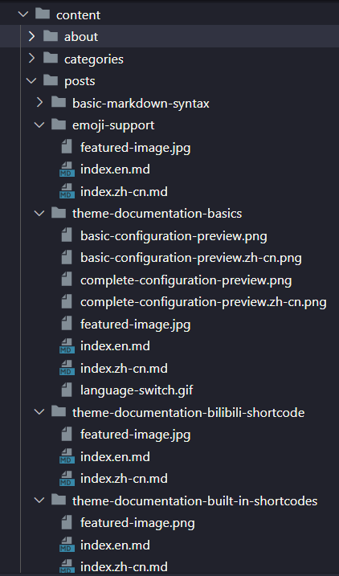

# Administroot的个人网站

[](https://app.netlify.com/sites/stately-parfait-69b7b5/deploys)

## 致考古人员

### Prerequisites

Although not required in all cases, [Git](https://git-scm.com/), [Go](https://go.dev/), and [Hugo](https://gohugo.io/installation/windows/) are commonly used when deploying this blog.

```shell
git submodule add --name LoveIt https://github.com/dillonzq/LoveIt.git themes/LoveIt
cd themes/LoveIt && git checkout v0.3.0
cd -
hugo server
```

## 简介

本站是Administroot的个人网站，主要用于记录个人的学习经历，以及一些技术的学习笔记。

## 开发事项

在开发中，可以参考themes/Lovelt/exampleSite目录下的内容
在content/posts目录下创建Markdown文件，文件格式如下


## 目录结构

- 关于(about)
- 分类(catagories)
- 标签(tags)
- 所有文章(posts)
