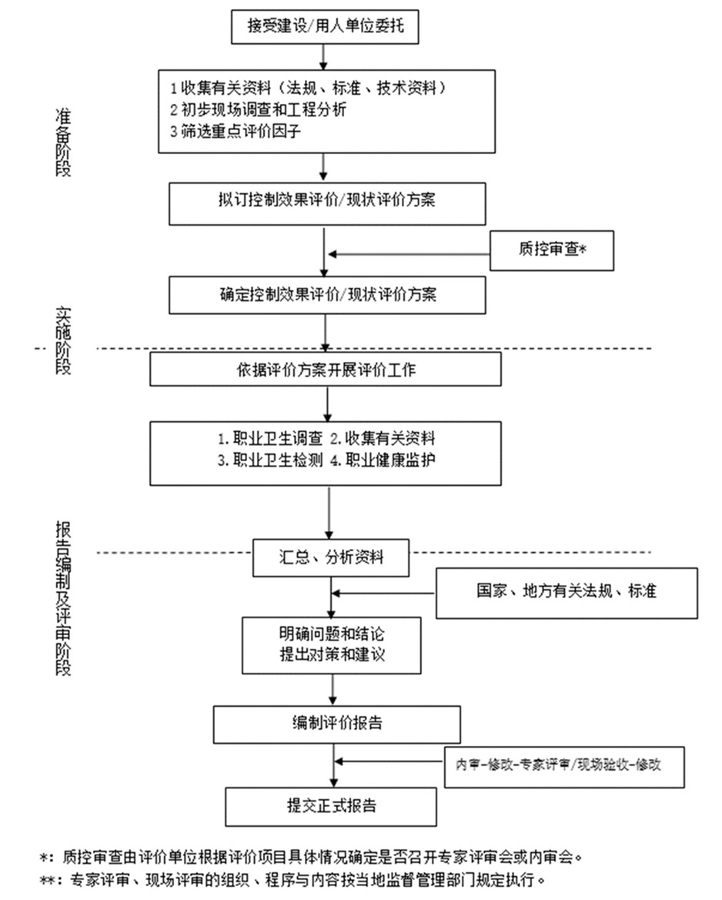

带你一条龙了解现状评价中职业病危害因素识别、采样、体检。

<!--more-->


本文章为作者依个人经验所著，仅做参考，如有错误，请及时指出，万分感谢！！


## 流程

职业病危害因素（简称*接害因素*）贯穿整篇现状评价（简称“*现评*”），是现评中最重要、最核心的要素。
在这里先贴一张评价工作流程，建议存下图。

好了吗，我们要开始了哦:sunglasses:。

## 职业病危害因素识别

该步骤需要我们在“**现状评价（采样）方案**”撰写之前来完成。

一个典型的“**现状评价（采样）方案**”中包含的重要内容如下。

| 单元名称 | 岗位 | 作业点 | 检测项目 | 点数 | 天数 | 设备数 | 接触时间(h/d) | 接触人数(人/班) |
| :---: | :---: | :---: | :---: | :---: | :---: | :---: | :---: | :---: |
| 1号厂房 | 喷漆房 | 喷漆工作位#1 | 甲苯 | 1 | 3 | 4 | 4 | 1 |
| 1号厂房 | 喷漆房 | 喷漆工作位#1 | 二甲苯 | 1 | 3 | 4 | 4 | 1 |
| 1号厂房 | 喷漆房 | 喷漆工作位#1 | 乙酸乙酯 | 1 | 3 | 4 | 4 | 1 |
| 1号厂房 | 喷漆房 | 喷漆工作位#1 | 噪声 | 2 | 3 | 4 | 4 | 1 |
| 1号厂房 | 喷漆房 | 喷漆工作位#1 | 控制风速 | 1 | 3 | 4 | 4 | 1 |
| 1号厂房 | 喷漆房 | 喷漆工作位#1 | 照度 | 1 | 3 | 4 | 4 | 1 |
| 1号厂房 | 喷漆房 | 喷漆工作位#1 | 新风量 | 1 | 3 | 4 | 4 | 1 |

其中单元、岗位、作业点、检测项目均为**1对N**的关系。我们通常以“**作业点**”为最小的识别单位。

上表我将与[采样方案制订](#采样方案制订)章节更多细节，这里大家留个印象即可。

在“现状评价方案”撰写之前，从客户那儿我们需要拿到[MSDS](https://zhuanlan.zhihu.com/p/29650273)、生产工艺、设备布局等资料。

我们需要结合各种有关资料开展我们的工作，比如产品的工艺流程、岗位设置、[MSDS](https://zhuanlan.zhihu.com/p/29650273)等，材料不充分的在整理之后询问客户，或者约好时间去现场调查。

### 化学因素识别

> 更多细节见[职业病危害因素识别](../identification_of_occupational_hazard_factors/)。

在每个**作业点**工作的工人在进行日常工作中，在作业过程中可能会接触到各种有害的**化学物质**损害他们的健康，这些物质既可能是**MSDS组分**，又可能是**产物**。比如油墨、粉尘、有害气体等等。

在[MSDS](https://zhuanlan.zhihu.com/p/29650273)中，对我们有用的信息主要是*化学品名称*和它的*组分*。假如这个*作业点*接触该*化学物料*，该*化学物料*含有该*化学物质*，则该作业点具有该*化学接害因素*。

总之，不管通过什么手段，在你的脑海（抑或你的OFFICE）中，需要形成下面一张表。

| 所处工序 | 岗位 | 作业点 | 物料 | 物料含有的化学物质(化学接害因素) |
| :---: | :---: | :---: | :---: | :---: |
| 喷漆 | 喷漆房 | 喷漆工作位#1 | 底漆 | 甲苯、二甲苯、乙酸乙酯、N-苯基-1-萘胺 |

部分岗位如[二保焊](https://zhuanlan.zhihu.com/p/165292532)、干磨机岗等需要根据岗位的实际情况识别化学因素，详见[职业病危害因素识别](../identification_of_occupational_hazard_factors/)。

### 物理因素识别

> 更多细节见[职业病危害因素识别](../identification_of_occupational_hazard_factors/)。

常见的物理因素有以下几种：高温、噪声、工频电场、电焊弧光等，详见[GBZ 2.2](https://niohp.chinacdc.cn/zyws/wefscvn/202109/t20210914_236250.htm)。

- **高温**通常是作业环境涉及到一些会产生热的设备如烘干机，以及高温作业环境。
- **噪声**常见情况是作业环境涉及到一些会产生噪声的设备，大部分的大型工程设备都有噪声因素。
- **工频电场**主要和**配电房**联系在一起。

## 采样方案制订

> 更多细节见[采样方案制订](../developing_a_sampling_plan/)。

在经过调研和分析后，我们得到了各个岗位的**化学**接害因素和**物理**接害因素。

是时候编制采样方案，交给采样人员去采样了。等到采样结果出来我们才能真正开始撰写**现评报告**，**现评报告**内容必须与检测结果出来之后的**检测结果报告**相一致。见如下流程：


sequenceDiagram
    participant 评价员
    participant 采样人员
    Note left of 评价员: 职业病危害因素识别
    评价员->>客户: 询问资料
    loop
        客户->客户: 整理资料
    end
    客户->>评价员: 发送资料
    评价员->>客户: 实地考察
    loop
        评价员->评价员: 识别接害因素
    end
    Note left of 评价员: 采样流程
    loop
        评价员->评价员: 编写采样方案
    end
    评价员-->客户: 协商确定采样方案
    评价员->>采样人员: 提交采样方案
    loop
        采样人员->采样人员: 进行采样
    end
    采样人员-->评价员: 检测报告
    loop
        评价员-->评价员: 撰写现评报告
    end


让我们重新回顾一下现状评价（采样）方案的结构：

| 单元名称 | 岗位 | 作业点 | 检测项目 | 点数 | 天数 | 设备数 | 接触时间(h/d) | 接触人数(人/班) |
| :---: | :---: | :---: | :---: | :---: | :---: | :---: | :---: | :---: |
| 1号厂房 | 喷漆房 | 喷漆工作位#1 | 甲苯 | 1 | 3 | 1 | 4 | 1 |
| 1号厂房 | 喷漆房 | 喷漆工作位#1 | 二甲苯 | 1 | 3 | 1 | 4 | 1 |
| 1号厂房 | 喷漆房 | 喷漆工作位#1 | 乙酸乙酯 | 1 | 3 | 1 | 4 | 1 |
| 1号厂房 | 喷漆房 | 喷漆工作位#1 | 噪声 | 2 | 1 | 1 | 4 | 1 |
| 1号厂房 | 喷漆房 | 喷漆工作位#1 | 控制风速 | 1 | 1 | 1 | 4 | 1 |
| 1号厂房 | 喷漆房 | 喷漆工作位#1 | 照度 | 1 | 1 | 1 | 4 | 1 |
| 1号厂房 | 喷漆房 | 喷漆工作位#1 | 新风量 | 1 | 1 | 1 | 4 | 1 |

上表中的检测项目与上一章节[职业病危害因素识别](#职业病危害因素识别)所述的**化学**接害因素和**物理**接害因素既有重叠部分，又有不同部分，主要体现以下几个方面。

- **采样方案**中的**化学**接害因素和**物理**接害因素需要囊括在[GBZ 2.1及GBZ 2.2](https://niohp.chinacdc.cn/zyws/wefscvn/202109/t20210914_236250.htm)所规定的范围内。若不在该范围内，则仅做*识别*不做*采样*。

  
  :chestnut:原辅料*MSDS*中含有“[N-苯基-1-萘胺](https://www.chemsrc.com/cas/90-30-2_954649.html)”，在GBZ 2.1中未做规定，仅做识别不做采样。
  

  - 部分接害因素是特例，需要进一步分析。如黄沙、水泥粉等粉尘需要根据$SiO_2$的含量进行识别*矽尘*；玻璃纤维需要识别*人造矿物纤维绝热棉粉尘*。

- 检测点位数量**设备数**有关，规则如下
  - 1~3个设备每个操作位1个检测点位
  - 4~10个设备每个操作位2个检测点位
  - 大于10个设备每个操作位3个检测点位

- 上表中的**控制风速**属于**工程防护措施**参数。用人单位岗位假如有**化学**接害因素，且该化学物质会**逸散**至空气中，则应在作业点配备吸风罩。需要检测的吸风罩的参数通常为*控制风速、罩口风速*

- 上表中的**新风量**属于**建筑设计卫生学**，测的是**新风系统**。照度的检测点位需要根据**平面图**或者**现场考察**来设置。通常来说，一个**无隔断**的区域设置一个检测点位，具体可根据实际情况进行决定。

  
  :chestnut:A岗和B岗的工人在一条流水线上，甚至作业时可以互相看到对方，那么很显然这个区域只设置一个检测点位。
  
  另外一种情况，A岗的工人作业时经常跑来跑去（通常情况为巡检岗），或者作业区域有**隔断**，那么每有一个隔断区域，该隔断区域需要设置一个检测点位。
  
  
  **综上**，照度的设置与岗位、作业点的设置**无关**，仅与**厂房空间格局**有关。只有有新风系统的岗位才需要测新风量。

- 部分作业场所仅通过**自然通风**难以达到相关要求，需要使用**机械通风**进行通风排毒。如果没有安装机械通风设备，自然也不需要测了。

  
  机械通风（指标*换气次数*）、新风系统（测量指标*新风量*）只是通风设备，不是**工程防护**设施。

  吸风罩（测量指标*控制风速*、*罩口风速*）或者风柜、吸风管才是**工程防护设施**。
  

- 上表中的**天数**，即**检测天数**，规定如下：
  - 化学接害因素为3天
  - 物理接害因素为1天
  - 其他检测项目为1天

- 上表中的**接触时间**不用自己想，用人单位来提供。

- 上表中的**接触人数**即该操作点的**工作人数**，用人单位操作点、岗位的设计就是按照**接害因素**来的。

## 职业健康体检

> 更多细节见[职业健康体检](../health_check/)。

做现评报告时，用人单位会提供**近三年**的职业健康体检报告。一家企业的体检有没有做到位，主要看如下几个方面。

1. 用人单位有没有提供**3年**的体检报告。
2. 用人单位提供的报告有没有覆盖**岗前**、**在岗（岗中）**、**离岗**三方面的资料。（需要你看这三年内人员数量是否有变动，有变动必至少有两类资料；无变动可能只有在岗资料）
3. 用人单位体检报告中检查的**职业危害因素**是否包括[采样方案](#采样方案制订)中的所有**接害因素**。
